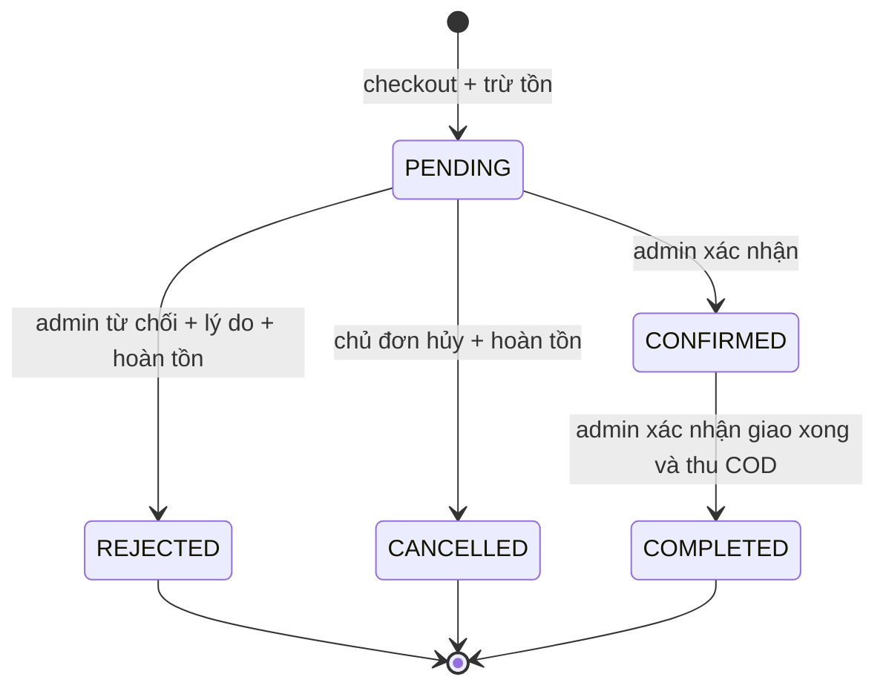

# Thiết kế database — Mini Ecommerce

Đây là bản thiết kế để học, self-review và gửi mentor; **chưa được mentor duyệt**. Phạm vi full sheet: backend bán hàng nhỏ trong 130 giờ, thực hiện trong 25 ngày ở năng lực 5,2 giờ/ngày; thanh toán COD, một ảnh cho mỗi sản phẩm, chat support text-only, product suggestion và báo cáo doanh thu. Không có biến thể, mã giảm giá, phí vận chuyển hay cổng thanh toán online. Đọc cùng [kế hoạch full scope](./full-scope-plan.md) và đặc tả API trong thư mục này. File chỉnh sửa bằng draw.io: [ecommerce.drawio](./ecommerce.drawio).

Thiết kế dùng PostgreSQL 16 và TypeORM 0.3 theo nền tutorial. Mười bốn bảng bên dưới là đích thiết kế của project mới, không phải schema đã triển khai trong repository hiện tại. Khi tái sử dụng tutorial, giữ phần nền cần thiết và điều chỉnh entity/migration có chủ đích; không mặc định mang bảng articles, follows, favorites, comments vào dự án bán hàng.

## 1. Đi từ requirement đến database

Làm theo thứ tự này trước khi vẽ ô đầu tiên:

1. Viết câu nghiệp vụ có chủ thể, hành động, điều kiện và kết quả: “Customer đặt toàn bộ giỏ hàng; sản phẩm phải còn bán và đủ tồn; server chốt giá tại thời điểm đặt; lỗi thì không tạo đơn và không trừ tồn.”
2. Gạch danh từ cần lưu lâu dài: user, auth token, category, product, review, cart item, order, order item, image, status history, email notification, support conversation, chat message và product suggestion. Không phải danh từ nào cũng thành bảng: `role` chỉ có hai giá trị ổn định nên là cột; địa chỉ giao hàng là snapshot trong đơn; share link và thống kê được tính từ dữ liệu hiện có.
3. Ghi truy vấn thực tế: danh sách sản phẩm phân trang, giỏ của user, lịch sử đơn của user, đơn theo trạng thái cho admin, email chờ gửi. Truy vấn quyết định index.
4. Tách quan hệ: một user có nhiều đơn; một đơn có nhiều dòng hàng. User và product có quan hệ nhiều-nhiều qua `cart_items`, vì quan hệ này còn có `quantity`.
5. Chọn khóa chính, khóa ngoại, nullable và cách xử lý xóa. UUID định danh bản ghi; tên và email có thể thay đổi nên không làm khóa chính.
6. Viết invariant: số lượng dương, tồn không âm, không trùng sản phẩm trong một giỏ, tổng đơn lấy từ giá server, trạng thái chỉ chuyển theo sơ đồ. Phân biệt điều nào DB tự bảo vệ và điều nào service phải bảo vệ.
7. Vẽ ERD; thử kể lại ba tình huống: đặt hàng, hủy đơn, admin sửa tên/giá sau khi đơn đã tạo. Nếu không giải thích được dữ liệu còn lại, thiết kế còn thiếu.
8. Đối chiếu từng endpoint với bảng đọc/ghi và test tương ứng, rồi gửi mentor review trước khi làm migration lớn.

| Requirement                       | Truy vấn/ghi chính                                   | Bảng suy ra                                | Quyết định quan trọng                                               |
| --------------------------------- | ---------------------------------------------------- | ------------------------------------------ | ------------------------------------------------------------------- |
| Đăng ký, login, kích hoạt/reset   | Tìm email; token hash một lần; đọc role/status       | `users`, `auth_tokens`                     | Chỉ lưu password/token hash; client không tự chọn ADMIN             |
| Hồ sơ và admin quản lý user       | Update owner; list/filter role/status                | `users`                                    | JWT luôn đọc status; không có API đổi role                          |
| Xem/tìm/lọc sản phẩm              | Lọc active/category; sort `created_at DESC, id DESC` | `categories`, `products`                   | Danh mục hoặc sản phẩm bị ẩn thì không được checkout                |
| Review sản phẩm                   | List theo product; một user một review               | `reviews`                                  | Chỉ customer đã có đơn COMPLETED chứa product                       |
| Upload một ảnh sản phẩm           | Tìm metadata theo image ID                           | `attachments`, `products.image_id`         | File ở storage, metadata ở DB                                       |
| Sửa giỏ                           | Tìm theo user + product                              | `cart_items`                               | UNIQUE hai cột; tối đa 20 dòng                                      |
| Đặt hàng, lịch sử đơn             | Ghi header + dòng hàng; list theo user               | `orders`, `order_items`                    | Snapshot tên/SKU/giá/địa chỉ; không đọc lại giá hiện tại cho đơn cũ |
| Xác nhận/từ chối/hủy/hoàn tất     | Khóa đơn, kiểm tra trạng thái                        | `orders`, `order_status_history`           | Hoàn tồn đúng một lần khi hủy hoặc từ chối đơn PENDING              |
| Gửi mail qua Redis; dùng schedule | Tìm các thông báo PENDING                            | `email_notifications`                      | Ghi ý định gửi cùng transaction; scheduler chuyển sang Bull         |
| Chat customer với admin           | Conversation mở; message theo cursor                 | `chat_conversations`, `chat_messages`      | Lưu trước rồi publish WebSocket; kiểm owner/admin mỗi room          |
| Gợi ý sản phẩm                    | Customer tạo/list; admin review                      | `product_suggestions`                      | PENDING chỉ được review một lần; approve không tự tạo product       |
| Thống kê và mail cuối tháng       | Aggregate order hoàn tất theo kỳ                     | Bảng order hiện có + `email_notifications` | Chỉ COMPLETED; report idempotent theo recipient/kỳ                  |

## 2. Quy ước để đọc ERD và viết entity

- Mọi bảng có `id uuid PRIMARY KEY`, sinh UUID tại ứng dụng trước insert; không phụ thuộc extension UUID trong migration. Mọi cột mặc định `NOT NULL` trừ khi ghi rõ `NULL`.
- Tên bảng/cột SQL dùng `snake_case`; property TypeScript dùng `camelCase` và map tên bằng decorator. Ví dụ `priceVnd` ↔ `price_vnd`.
- `created_at`, `updated_at`, `completed_at`, `sent_at` là `timestamptz`; API trả ISO 8601 UTC. `created_at`/`updated_at` mặc định `now()`; TypeORM cập nhật `updated_at` khi sửa, câu SQL thủ công phải tự cập nhật trường này.
- `UK` nghĩa là unique; `FK` nghĩa là khóa ngoại; `?` trong file draw.io nghĩa là nullable. `1 — 0..N` nghĩa là một bản ghi cha có thể chưa có hoặc có nhiều bản ghi con.
- Dùng `varchar + CHECK` cho role/status/locale trong bản MVP để dễ đọc và sửa migration; enum/type ở TypeScript phải khớp CHECK. Không trộn nhiều cách lưu cùng một loại trạng thái.
- Tiền VND lưu `numeric(14,0)` và trả JSON dạng chuỗi, ví dụ `"250000"`. DTO nhận chuỗi chỉ gồm chữ số và kiểm tra cận trước khi chuyển kiểu; PostgreSQL có thể làm tròn phần lẻ khi cast sang scale 0, vì vậy không dựa vào kiểu DB để từ chối input như `12.5`.
- Cận nghiệp vụ: giá một sản phẩm `1..1_000_000_000` VND, mỗi dòng `1..99`, mỗi đơn tối đa 20 dòng. Tổng tối đa `1_980_000_000_000`, nhỏ hơn `Number.MAX_SAFE_INTEGER`; phép tính nguyên bằng Number chỉ an toàn khi kiểm tra các cận này, sau đó serialize thành chuỗi. Nếu mở rộng cận, đổi sang thư viện decimal hoặc BigInt và cập nhật hợp đồng API.

## 3. ERD

```mermaid
erDiagram
    users ||--o{ auth_tokens : "user_id RESTRICT"
    users ||--o{ cart_items : "user_id CASCADE"
    users ||--o{ orders : "user_id RESTRICT"
    users ||--o{ reviews : "user_id RESTRICT"
    users o|--o{ order_status_history : "actor_user_id RESTRICT"
    categories ||--o{ products : "category_id RESTRICT"
    attachments o|--o| products : "image_id SET NULL + UNIQUE"
    products ||--o{ cart_items : "product_id RESTRICT"
    products ||--o{ order_items : "product_id RESTRICT"
    products ||--o{ reviews : "product_id RESTRICT"
    orders ||--|{ order_items : "order_id RESTRICT"
    orders ||--|{ order_status_history : "order_id RESTRICT"
    orders o|--o{ email_notifications : "order_id RESTRICT"
    auth_tokens o|--o| email_notifications : "auth_token_id RESTRICT"
    users ||--o{ chat_conversations : "customer_id RESTRICT"
    users o|--o{ chat_conversations : "assigned_admin_id RESTRICT"
    chat_conversations ||--o{ chat_messages : "conversation_id RESTRICT"
    users ||--o{ chat_messages : "sender_id RESTRICT"
    users ||--o{ product_suggestions : "customer_id RESTRICT"
    users o|--o{ product_suggestions : "reviewed_by RESTRICT"

    users {
        uuid id PK
        varchar email UK
        varchar username UK
        varchar password_hash
        varchar role
        varchar status
        timestamptz email_verified_at
        integer token_version
        timestamptz created_at
        timestamptz updated_at
    }
    auth_tokens {
        uuid id PK
        uuid user_id FK
        varchar type
        char token_hash UK
        timestamptz expires_at
        timestamptz used_at
        timestamptz created_at
    }
    attachments {
        uuid id PK
        varchar storage_key UK
        varchar mime_type
        integer size_bytes
        timestamptz created_at
    }
    categories {
        uuid id PK
        varchar name
        varchar slug UK
        boolean is_active
        timestamptz created_at
        timestamptz updated_at
    }
    products {
        uuid id PK
        uuid category_id FK
        uuid image_id FK,UK
        varchar name
        text description
        varchar sku UK
        numeric price_vnd
        integer stock
        boolean is_active
        boolean is_featured
        timestamptz created_at
        timestamptz updated_at
    }
    cart_items {
        uuid id PK
        uuid user_id FK
        uuid product_id FK
        integer quantity
        timestamptz created_at
        timestamptz updated_at
    }
    reviews {
        uuid id PK
        uuid user_id FK
        uuid product_id FK
        smallint rating
        varchar comment
        timestamptz created_at
        timestamptz updated_at
    }
    orders {
        uuid id PK
        uuid user_id FK
        varchar status
        numeric total_vnd
        varchar payment_method
        varchar recipient_name
        varchar phone
        text address_snapshot
        text customer_note
        text rejection_reason
        uuid idempotency_key
        char request_hash
        timestamptz completed_at
        timestamptz created_at
        timestamptz updated_at
    }
    order_items {
        uuid id PK
        uuid order_id FK
        uuid product_id FK
        varchar product_name_snapshot
        varchar sku_snapshot
        numeric unit_price_vnd
        integer quantity
        numeric line_total_vnd
        timestamptz created_at
    }
    order_status_history {
        uuid id PK
        uuid order_id FK
        varchar from_status
        varchar to_status
        uuid actor_user_id FK
        text reason
        timestamptz created_at
    }
    email_notifications {
        uuid id PK
        uuid order_id FK_nullable
        uuid auth_token_id FK_nullable
        date report_period nullable
        varchar event_type
        varchar recipient_email
        varchar locale
        jsonb payload
        varchar status
        integer attempts
        timestamptz sent_at
        text last_error
        timestamptz created_at
        timestamptz updated_at
    }
    chat_conversations {
        uuid id PK
        uuid customer_id FK
        uuid assigned_admin_id FK_nullable
        varchar status
        timestamptz last_message_at
        timestamptz created_at
        timestamptz updated_at
    }
    chat_messages {
        uuid id PK
        uuid conversation_id FK
        uuid sender_id FK
        uuid idempotency_key
        char request_hash
        varchar body
        timestamptz read_at
        timestamptz created_at
    }
    product_suggestions {
        uuid id PK
        uuid customer_id FK
        uuid reviewed_by FK_nullable
        varchar name
        text description
        varchar category_name
        varchar status
        text review_reason
        timestamptz reviewed_at
        timestamptz created_at
        timestamptz updated_at
    }
```

Quan hệ order → items/history có tối thiểu một bản ghi con theo nghiệp vụ khi tạo đơn thành công; order cũng tạo một email notification. Khóa ngoại chỉ bảo vệ “con phải trỏ tới cha”; nó không tự bảo đảm “cha phải có con”. Transaction checkout và e2e bảo vệ nửa còn lại. Review chỉ được tạo khi customer đã có order COMPLETED chứa product; đây là rule xuyên bảng do service và integration test bảo vệ. Conversation có thể chưa có message ngay sau khi mở; mỗi customer chỉ có một conversation OPEN bằng partial unique index. WebSocket không thay DB làm nguồn lịch sử.

## 4. Từ điển dữ liệu và ràng buộc

### `users` — danh tính và quyền

| Cột ngoài PK/timestamps | Kiểu SQL           | Ràng buộc/ý nghĩa                                                                                      |
| ----------------------- | ------------------ | ------------------------------------------------------------------------------------------------------ |
| `email`                 | `varchar(254)`     | UNIQUE; trim + lowercase trước ghi; CHECK `email = lower(btrim(email))`; validate email ở DTO          |
| `username`              | `varchar(30)`      | UNIQUE; trim + lowercase trước ghi; 3..30 ký tự `[a-z0-9_]`; CHECK `username = lower(btrim(username))` |
| `password_hash`         | `varchar(255)`     | Hash bằng cơ chế tutorial; không đưa vào response/log                                                  |
| `role`                  | `varchar(16)`      | DEFAULT `CUSTOMER`; CHECK trong `CUSTOMER`, `ADMIN`                                                    |
| `status`                | `varchar(24)`      | DEFAULT `PENDING`; CHECK trong `PENDING`, `ACTIVE`, `INACTIVE`                                         |
| `email_verified_at`     | `timestamptz NULL` | Có sau verify; PENDING phải NULL, ACTIVE/INACTIVE phải khác NULL                                       |
| `token_version`         | `integer`          | DEFAULT 0; CHECK >= 0; JWT mang version hiện tại, tăng khi đổi/reset mật khẩu hoặc deactivate          |

Không cần bảng roles/permissions riêng khi chỉ có hai role. Registration luôn tạo CUSTOMER/PENDING; verify email chuyển PENDING → ACTIVE. Admin chỉ đổi ACTIVE ↔ INACTIVE, không đổi role và không tự deactivate. JWT strategy đọc user/status ở DB; chỉ ACTIVE được dùng API bảo vệ. Ownership vẫn phải kiểm tra ở service. Không có API xóa user trong MVP; FK tới đơn/review/token bảo vệ lịch sử.

### `auth_tokens` — token kích hoạt và reset dùng một lần

| Cột ngoài PK/created_at | Kiểu SQL           | Ràng buộc/ý nghĩa                                                       |
| ----------------------- | ------------------ | ----------------------------------------------------------------------- |
| `user_id`               | `uuid`             | FK users; `ON DELETE RESTRICT`                                          |
| `type`                  | `varchar(24)`      | CHECK `EMAIL_VERIFICATION/PASSWORD_RESET`                               |
| `token_hash`            | `char(64)`         | UNIQUE; SHA-256 lowercase hex của token ngẫu nhiên; không lưu raw token |
| `expires_at`            | `timestamptz`      | CHECK lớn hơn `created_at`; TTL lấy từ config                           |
| `used_at`               | `timestamptz NULL` | NULL khi chưa dùng; consume token và update user trong cùng transaction |

Khi tạo reset token mới, transaction đánh `used_at` cho token reset cũ chưa dùng và chuyển email notification PENDING tương ứng sang FAILED với lý do `SUPERSEDED`; không gửi link đã vô hiệu. Endpoint forgot-password luôn trả cùng response. Raw token không nằm trong auth_tokens, response hay log; cách lưu mã hóa cho outbox được mô tả ở `email_notifications`. Cleanup token hết hạn là việc bảo trì P1, không cần cron thứ hai trong MVP.

### `attachments` — thông tin file

| Cột ngoài PK/created_at | Kiểu SQL       | Ràng buộc/ý nghĩa                                                                      |
| ----------------------- | -------------- | -------------------------------------------------------------------------------------- |
| `storage_key`           | `varchar(255)` | UNIQUE; key ngẫu nhiên do server tạo; không dùng trực tiếp tên/path do client cung cấp |
| `mime_type`             | `varchar(100)` | CHECK trong `image/jpeg`, `image/png`, `image/webp`                                    |
| `size_bytes`            | `integer`      | CHECK `size_bytes > 0 AND size_bytes <= 2097152` (2 MiB)                               |

Chỉ admin upload ảnh qua endpoint gắn với sản phẩm; không cần polymorphic owner cho phạm vi này. Kiểm tra byte signature và size thực tế trước lưu, không chỉ tin MIME từ request. DB transaction không rollback file vật lý: ghi file mới với key ngẫu nhiên, transaction tạo metadata và đổi `products.image_id`; nếu lỗi dọn file mới, nếu thành công dọn file cũ sau commit. Dọn lỗi có thể retry; việc dọn file orphan có thể là mở rộng sau core schedule.

### `categories` — nhóm sản phẩm

| Cột ngoài PK/timestamps | Kiểu SQL       | Ràng buộc/ý nghĩa                                                              |
| ----------------------- | -------------- | ------------------------------------------------------------------------------ |
| `name`                  | `varchar(100)` | Không trắng, tối đa 100 ký tự                                                  |
| `slug`                  | `varchar(120)` | UNIQUE; chuẩn hóa lowercase; pattern slug ở DTO                                |
| `is_active`             | `boolean`      | DEFAULT `true`; ẩn danh mục cũng ẩn sản phẩm khỏi danh sách public và checkout |

Chỉ hard-delete danh mục rỗng. Nếu có bất kỳ sản phẩm, kể cả đã archive, trả `409 CATEGORY_IN_USE`. Không cascade xóa sản phẩm.

### `products` — giá và tồn hiện tại

| Cột ngoài PK/timestamps | Kiểu SQL        | Ràng buộc/ý nghĩa                                                                     |
| ----------------------- | --------------- | ------------------------------------------------------------------------------------- |
| `category_id`           | `uuid`          | FK categories; `ON DELETE RESTRICT`                                                   |
| `image_id`              | `uuid NULL`     | FK attachments; `ON DELETE SET NULL`; UNIQUE, một attachment thuộc tối đa một product |
| `name`                  | `varchar(200)`  | Không trắng, tối đa 200 ký tự                                                         |
| `description`           | `text`          | Tối đa 5000 ký tự; có thể chuỗi rỗng                                                  |
| `sku`                   | `varchar(64)`   | UNIQUE; trim + uppercase trước ghi; SKU có ý nghĩa quản trị, ID phục vụ relation      |
| `price_vnd`             | `numeric(14,0)` | CHECK từ 1 đến 1_000_000_000                                                          |
| `stock`                 | `integer`       | DEFAULT 0; CHECK `stock >= 0`                                                         |
| `is_active`             | `boolean`       | DEFAULT `true`; archive bằng `false`                                                  |
| `is_featured`           | `boolean`       | DEFAULT `false`; danh sách nổi bật vẫn phải active                                    |

Không hard-delete product đã tạo; API archive cập nhật `is_active=false`. Cart giữ product ID và đọc giá mới nhất khi xem; order item giữ snapshot giá khi mua. Khi cập nhật tồn thủ công, admin cũng phải dùng lock trên product, không đọc rồi ghi giá trị tồn từ một bản đọc cũ.

### `cart_items` — một dòng trong giỏ của user

| Cột ngoài PK/timestamps | Kiểu SQL  | Ràng buộc/ý nghĩa                 |
| ----------------------- | --------- | --------------------------------- |
| `user_id`               | `uuid`    | FK users; `ON DELETE CASCADE`     |
| `product_id`            | `uuid`    | FK products; `ON DELETE RESTRICT` |
| `quantity`              | `integer` | CHECK từ 1 đến 99                 |

UNIQUE (`user_id`, `product_id`). Không tạo bảng carts vì mỗi user chỉ có một giỏ hiện hành, không hỗ trợ giỏ guest hay nhiều giỏ. Tối đa 20 sản phẩm khác nhau là constraint nhiều dòng: service kiểm tra dưới lock user. Giỏ chưa giữ chỗ tồn; chỉ checkout mới trừ tồn.

### `reviews` — đánh giá một cấp cho sản phẩm

| Cột ngoài PK/timestamps | Kiểu SQL        | Ràng buộc/ý nghĩa                 |
| ----------------------- | --------------- | --------------------------------- |
| `user_id`               | `uuid`          | FK users; `ON DELETE RESTRICT`    |
| `product_id`            | `uuid`          | FK products; `ON DELETE RESTRICT` |
| `rating`                | `smallint`      | CHECK từ 1 đến 5                  |
| `comment`               | `varchar(2000)` | Không blank, tối đa 2000 ký tự    |

UNIQUE (`user_id`, `product_id`). Trước insert, service dùng `EXISTS` để kiểm user có order COMPLETED chứa product; unique constraint xử lý hai request tạo đồng thời. List review trả user ID/username, không email; average rating dùng aggregate query, không tải toàn bộ review vào Node. Owner được sửa/xóa; admin không sửa nội dung thay customer trong MVP.

### `orders` — header của đơn

| Cột ngoài PK/timestamps | Kiểu SQL           | Ràng buộc/ý nghĩa                                                         |
| ----------------------- | ------------------ | ------------------------------------------------------------------------- |
| `user_id`               | `uuid`             | FK users; `ON DELETE RESTRICT`                                            |
| `status`                | `varchar(16)`      | DEFAULT `PENDING`; CHECK `PENDING/CONFIRMED/COMPLETED/CANCELLED/REJECTED` |
| `total_vnd`             | `numeric(14,0)`    | CHECK từ 1 đến 1_980_000_000_000; bằng tổng dòng hàng do service tính     |
| `payment_method`        | `varchar(16)`      | DEFAULT `COD`; CHECK chỉ `COD`                                            |
| `recipient_name`        | `varchar(100)`     | Không trắng; tên người nhận tại lúc đặt                                   |
| `phone`                 | `varchar(20)`      | Chuỗi để giữ số 0 đầu; validate định dạng trong DTO                       |
| `address_snapshot`      | `text`             | Không trắng; tối đa 500 ký tự; địa chỉ tại lúc đặt                        |
| `customer_note`         | `text NULL`        | Tối đa 500 ký tự                                                          |
| `rejection_reason`      | `text NULL`        | Tối đa 500 ký tự; bắt buộc không trắng khi REJECTED                       |
| `idempotency_key`       | `uuid`             | Key do client gửi header; UNIQUE cùng `user_id`                           |
| `request_hash`          | `char(64)`         | SHA-256 của request đã canonicalize; CHECK 64 hex characters              |
| `completed_at`          | `timestamptz NULL` | Có giá trị khi và chỉ khi status COMPLETED                                |

Các CHECK cùng dòng nên có: `(status = 'COMPLETED') = (completed_at IS NOT NULL)`; REJECTED yêu cầu `rejection_reason IS NOT NULL AND btrim(rejection_reason) <> ''`, các trạng thái khác giữ lý do này NULL. `COD` chưa có nghĩa đã thu tiền; chuyển COMPLETED có nghĩa giao xong và đã thu COD. Không cần bảng payment vì chưa có giao dịch cổng thanh toán hay hoàn tiền.

### `order_items` — dữ liệu tại thời điểm mua

| Cột ngoài PK/created_at | Kiểu SQL        | Ràng buộc/ý nghĩa                                  |
| ----------------------- | --------------- | -------------------------------------------------- |
| `order_id`              | `uuid`          | FK orders; `ON DELETE RESTRICT`                    |
| `product_id`            | `uuid`          | FK products; `ON DELETE RESTRICT`                  |
| `product_name_snapshot` | `varchar(200)`  | Tên tại lúc checkout                               |
| `sku_snapshot`          | `varchar(64)`   | SKU tại lúc checkout                               |
| `unit_price_vnd`        | `numeric(14,0)` | CHECK từ 1 đến 1_000_000_000                       |
| `quantity`              | `integer`       | CHECK từ 1 đến 99                                  |
| `line_total_vnd`        | `numeric(14,0)` | CHECK `line_total_vnd = unit_price_vnd * quantity` |

UNIQUE (`order_id`, `product_id`). Các snapshot bất biến sau tạo đơn. Lưu product ID để truy vết, nhưng response đơn cũ lấy snapshot, không JOIN tên/giá hiện tại thay vào. Tổng qua nhiều dòng (`orders.total_vnd = SUM(order_items.line_total_vnd)`) phải bảo vệ trong transaction/service; không viết CHECK tham chiếu bảng khác. PostgreSQL nêu rõ giới hạn của CHECK và FK trong [tài liệu constraints](https://www.postgresql.org/docs/16/ddl-constraints.html).

### `order_status_history` — ai chuyển trạng thái, khi nào

| Cột ngoài PK/created_at | Kiểu SQL           | Ràng buộc/ý nghĩa                                                            |
| ----------------------- | ------------------ | ---------------------------------------------------------------------------- |
| `order_id`              | `uuid`             | FK orders; `ON DELETE RESTRICT`                                              |
| `from_status`           | `varchar(16) NULL` | NULL chỉ ở event tạo đơn                                                     |
| `to_status`             | `varchar(16)`      | Cùng tập status của orders                                                   |
| `actor_user_id`         | `uuid NULL`        | FK users; `ON DELETE RESTRICT`; NULL dành cho actor hệ thống nếu sau này cần |
| `reason`                | `text NULL`        | Tối đa 500 ký tự; lưu lý do từ chối, có thể lưu lý do hủy                    |

CHECK mỗi status thuộc tập cho phép; from NULL chỉ cho to PENDING; from khác to. Service kiểm tra cạnh chuyển trạng thái hợp lệ và role. Chỉ append, không có API sửa/xóa history. Tạo đơn ghi `NULL → PENDING`, actor là customer.

### `email_notifications` — ý định gửi email được lưu bền

| Cột ngoài PK/timestamps | Kiểu SQL           | Ràng buộc/ý nghĩa                                                                                     |
| ----------------------- | ------------------ | ----------------------------------------------------------------------------------------------------- |
| `order_id`              | `uuid NULL`        | FK orders; `ON DELETE RESTRICT`; dùng cho event đơn hàng                                              |
| `auth_token_id`         | `uuid NULL`        | FK auth_tokens; `ON DELETE RESTRICT`; dùng cho activation/reset                                       |
| `report_period`         | `date NULL`        | Ngày đầu tháng của kỳ báo cáo; chỉ dùng với `MONTHLY_REVENUE`                                         |
| `event_type`            | `varchar(32)`      | CHECK `EMAIL_VERIFICATION/PASSWORD_RESET/ORDER_PLACED/ORDER_CONFIRMED/ORDER_REJECTED/MONTHLY_REVENUE` |
| `recipient_email`       | `varchar(254)`     | Snapshot email nhận tại lúc phát sinh event                                                           |
| `locale`                | `varchar(2)`       | CHECK `vi/en`; ngôn ngữ template đã chốt                                                              |
| `payload`               | `jsonb`            | CHECK kiểu object; dữ liệu template tối thiểu, có `templateVersion: 1`; không chứa password/token     |
| `secret_ciphertext`     | `bytea NULL`       | Raw activation/reset token được mã hóa xác thực; NULL với event order; xóa sau SENT/hết hạn           |
| `status`                | `varchar(16)`      | DEFAULT `PENDING`; CHECK `PENDING/SENT/FAILED`                                                        |
| `attempts`              | `integer`          | DEFAULT 0; CHECK từ 0 đến 3 trong MVP                                                                 |
| `sent_at`               | `timestamptz NULL` | Có khi và chỉ khi SENT                                                                                |
| `last_error`            | `text NULL`        | Lỗi đã lọc dữ liệu nhạy cảm; tối đa 1000 ký tự                                                        |

CHECK bảo đảm đúng một context: event auth có `auth_token_id`, `secret_ciphertext` và hai context kia NULL; event order có `order_id` và hai context kia NULL; event monthly report có `report_period`, còn `order_id/auth_token_id/secret_ciphertext` NULL. Vì `auth_tokens` chỉ lưu hash nên worker cần ciphertext để dựng link sau khi Redis phục hồi; mã hóa bằng khóa riêng từ secret manager/env, không dùng JWT secret, không log và xóa sau khi gửi/hết hạn. Partial UNIQUE `auth_token_id WHERE auth_token_id IS NOT NULL`, `(order_id, event_type) WHERE order_id IS NOT NULL` và `(recipient_email,event_type,report_period) WHERE report_period IS NOT NULL` ngăn tạo trùng intent. Đây là bảng ghi chờ gửi; Redis/Bull là hàng đợi thực thi. Không lưu “mail đã gửi” khi mới enqueue.

### `chat_conversations` — một phiên support giữa customer và admin

| Cột ngoài PK/timestamps | Kiểu SQL           | Ràng buộc/ý nghĩa                                               |
| ----------------------- | ------------------ | --------------------------------------------------------------- |
| `customer_id`           | `uuid`             | FK users; `ON DELETE RESTRICT`; service yêu cầu role CUSTOMER   |
| `assigned_admin_id`     | `uuid NULL`        | FK users; `ON DELETE RESTRICT`; khi có phải là ADMIN ACTIVE     |
| `status`                | `varchar(16)`      | CHECK `OPEN/CLOSED`; DEFAULT `OPEN`                             |
| `last_message_at`       | `timestamptz NULL` | Dùng sort support inbox; update cùng transaction insert message |

Partial UNIQUE `(customer_id) WHERE status='OPEN'` chặn hai request mở conversation đồng thời. `CLOSED` là không nhận message; mở lại tạo conversation mới để lịch sử cũ không bị trộn. Assign/close khóa row conversation trước khi kiểm trạng thái. `last_message_at` là dữ liệu denormalized có chủ đích; e2e kiểm nó khớp message mới nhất.

### `chat_messages` — lịch sử chat bền

| Cột ngoài PK/created_at | Kiểu SQL           | Ràng buộc/ý nghĩa                                                 |
| ----------------------- | ------------------ | ----------------------------------------------------------------- |
| `conversation_id`       | `uuid`             | FK chat_conversations; `ON DELETE RESTRICT`                       |
| `sender_id`             | `uuid`             | FK users; `ON DELETE RESTRICT`; phải là customer owner hoặc ADMIN |
| `idempotency_key`       | `uuid`             | Key retry do sender cung cấp                                      |
| `request_hash`          | `char(64)`         | SHA-256 canonical body để phát hiện cùng key khác nội dung        |
| `body`                  | `varchar(2000)`    | Trim; CHECK length 1..2000                                        |
| `read_at`               | `timestamptz NULL` | NULL là chưa đọc; không dùng để bảo đảm delivery realtime         |

UNIQUE `(sender_id,idempotency_key)`. Index `(conversation_id,created_at DESC,id DESC)` phục vụ history cursor. Insert message và update `last_message_at` trong một transaction; publish WebSocket sau commit. Không lưu Socket.IO room/session trong DB.

### `product_suggestions` — workflow gợi ý sản phẩm

| Cột ngoài PK/timestamps | Kiểu SQL            | Ràng buộc/ý nghĩa                                    |
| ----------------------- | ------------------- | ---------------------------------------------------- |
| `customer_id`           | `uuid`              | FK users; `ON DELETE RESTRICT`; người tạo suggestion |
| `name`                  | `varchar(200)`      | Trim; CHECK length 2..200                            |
| `description`           | `text NULL`         | Tối đa 2000 ký tự                                    |
| `category_name`         | `varchar(100) NULL` | Text do customer đề xuất, không FK category hiện có  |
| `status`                | `varchar(16)`       | CHECK `PENDING/APPROVED/REJECTED`; DEFAULT `PENDING` |
| `reviewed_by`           | `uuid NULL`         | FK users; `ON DELETE RESTRICT`; ADMIN xử lý          |
| `review_reason`         | `text NULL`         | Bắt buộc khi REJECTED; tối đa 500 ký tự              |
| `reviewed_at`           | `timestamptz NULL`  | Có cùng lúc reviewer khi không còn PENDING           |

CHECK giữ bộ ba review nhất quán: PENDING không có reviewer/reviewed_at/reason; APPROVED có reviewer/reviewed_at và reason tùy chọn; REJECTED có đủ reviewer/reviewed_at/reason. Service khóa row rồi chỉ cho `PENDING → APPROVED|REJECTED`. Approve không insert product tự động.

## 5. Index xuất phát từ query

Primary key và UNIQUE đã tạo index tương ứng; không tạo thêm index trùng. Khóa ngoại phía con không tự được PostgreSQL tạo index; cần xét query và thao tác tới bảng cha trước khi thêm. [PostgreSQL constraints](https://www.postgresql.org/docs/16/ddl-constraints.html)

| Index dự kiến                                                                                          | Query hỗ trợ                         |
| ------------------------------------------------------------------------------------------------------ | ------------------------------------ |
| UNIQUE `users(email)` và `users(username)`                                                             | Login; kiểm tra đăng ký trùng        |
| `users(status, created_at DESC, id DESC)`                                                              | Admin lọc user theo trạng thái       |
| `auth_tokens(user_id, type, created_at DESC)`                                                          | Vô hiệu/tìm token mới của user       |
| UNIQUE `auth_tokens(token_hash)`                                                                       | Verify token không quét bảng         |
| UNIQUE `cart_items(user_id, product_id)`                                                               | Đọc/sửa giỏ theo user và product     |
| `cart_items(product_id)`                                                                               | FK lookup theo product               |
| `categories(is_active, created_at DESC, id DESC)`                                                      | Danh sách category active phân trang |
| `categories(created_at DESC, id DESC)`                                                                 | Admin list toàn bộ category          |
| `products(is_active, created_at DESC, id DESC)`                                                        | Public list các sản phẩm còn bán     |
| `products(category_id, is_active, created_at DESC, id DESC)`                                           | Public list theo danh mục            |
| `products(created_at DESC, id DESC)`                                                                   | Admin list không filter active       |
| UNIQUE `reviews(user_id, product_id)`                                                                  | Một user một review/product          |
| `reviews(product_id, created_at DESC, id DESC)`                                                        | List review sản phẩm                 |
| `orders(user_id, created_at DESC, id DESC)`                                                            | Lịch sử đơn của customer             |
| `orders(status, created_at DESC, id DESC)`                                                             | Admin list theo trạng thái           |
| `orders(created_at DESC, id DESC)`                                                                     | Admin list không filter trạng thái   |
| UNIQUE `orders(user_id, idempotency_key)`                                                              | Retry checkout trả đơn cũ            |
| UNIQUE `order_items(order_id, product_id)`                                                             | Detail đơn và ngăn dòng trùng        |
| `order_items(product_id)`                                                                              | Truy vết dòng hàng theo product      |
| `order_status_history(order_id, created_at, id)`                                                       | Timeline trạng thái                  |
| `order_status_history(actor_user_id)`                                                                  | FK lookup theo actor                 |
| UNIQUE `email_notifications(auth_token_id) WHERE NOT NULL`                                             | Một mail intent cho mỗi auth token   |
| UNIQUE `email_notifications(order_id,event_type) WHERE order_id IS NOT NULL`                           | Một mail intent cho mỗi order event  |
| UNIQUE `email_notifications(recipient_email,event_type,report_period) WHERE report_period IS NOT NULL` | Một monthly report/admin/kỳ          |
| `email_notifications(status, updated_at, id)`                                                          | Scheduler chọn PENDING theo batch    |
| UNIQUE `chat_conversations(customer_id) WHERE status='OPEN'`                                           | Một support conversation mở/customer |
| `chat_conversations(status, last_message_at DESC, id DESC)`                                            | Admin support inbox                  |
| `chat_conversations(assigned_admin_id, status, last_message_at DESC, id DESC)`                         | Inbox theo admin được assign         |
| UNIQUE `chat_messages(sender_id,idempotency_key)`                                                      | Retry gửi message không tạo trùng    |
| `chat_messages(conversation_id, created_at DESC, id DESC)`                                             | Cursor message history               |
| `product_suggestions(customer_id, created_at DESC, id DESC)`                                           | Customer xem suggestion của mình     |
| `product_suggestions(status, created_at DESC, id DESC)`                                                | Admin review queue                   |
| `orders(status, completed_at, id) WHERE status='COMPLETED'`                                            | Aggregate revenue theo khoảng ngày   |

UNIQUE `products(sku)`, `products(image_id)`, `categories(slug)`, `attachments(storage_key)` là business constraints và cũng có index. Đặt tên rõ, ví dụ `uq_orders_user_idempotency_key`, `ck_products_nonnegative_stock`, `idx_orders_user_created_id`; dùng đúng tên để map lỗi `23505` thành lỗi API tương ứng.

Tìm kiếm `ILIKE '%keyword%'` chưa được tăng tốc bởi B-tree tên thông thường. MVP dữ liệu demo nhỏ chấp nhận query có tham số và pagination; sau khi đo mới xem xét `pg_trgm`/GIN hoặc full-text. Không hứa “đã tối ưu” chỉ vì có index: seed đủ dữ liệu, chạy `EXPLAIN (ANALYZE, BUFFERS)` cho SELECT thật, lưu query + số dòng + execution plan vào PR. Với bảng nhỏ, planner chọn sequential scan vẫn có thể hợp lý.

## 6. Checkout: transaction bảo vệ tiền và tồn

`POST /orders` nhận thông tin người nhận và header `Idempotency-Key`; không nhận `total`, `price`, `userId` hay `status` từ client. Giỏ hàng là nguồn product/quantity. Cần transaction vì đơn, dòng hàng, tồn, giỏ, history và email intent phải thành công hoặc thất bại cùng nhau.

Thứ tự cố định:

1. Validate DTO và UUID key; lấy user ID từ auth. Canonicalize các field body (thứ tự key cố định, quy tắc trim/default thống nhất), tính SHA-256. **Hash không gồm giỏ hiện tại** vì giỏ sẽ bị xóa sau checkout.
2. Mở transaction; khóa row `users` của customer bằng `SELECT ... FOR UPDATE`. Mọi API ghi giỏ cũng phải khóa cùng row user trước khi ghi. Dùng row user vì giỏ có thể rỗng, chưa có cart row để khóa.
3. Tìm order theo `(user_id, idempotency_key)` trước khi đọc giỏ. Có order và hash giống: trả nguyên đơn cũ, kể cả giỏ đã rỗng. Hash khác: trả `409 IDEMPOTENCY_CONFLICT`. Không áp đặt unique toàn hệ thống lên key của hai user khác nhau.
4. Đọc cart trong transaction; yêu cầu 1..20 dòng, mỗi quantity 1..99. Lấy product IDs và sort tăng dần trước khi lock từng product bằng `FOR UPDATE`; dữ liệu tính toán lấy từ bản đọc sau lock.
5. Kiểm tra tồn đủ, product active và category active. Để quyết định active của category không bị sửa giữa kiểm tra và commit, khóa các category liên quan bằng shared row lock theo ID tăng dần sau product lock. Luồng admin sửa category chỉ khóa category; luồng admin sửa product dùng product rồi category cùng thứ tự, không khóa category rồi đợi product.
6. Tính unit price, line total và total bằng dữ liệu server với các cận đã nêu. Snapshot tên, SKU, địa chỉ và email nhận; tạo UUID cho order.
7. Insert `orders(PENDING)`, `order_items`, `order_status_history(NULL → PENDING)` và `email_notifications(ORDER_PLACED, PENDING)`. Giảm stock bằng update cùng transaction; điều kiện `stock >= quantity` và kiểm tra affected rows là lớp bảo vệ bổ sung.
8. Xóa cart của user; commit; sau đó trả response. Không gọi SMTP, Redis hoặc file I/O bên trong transaction checkout.

Mọi query trong callback phải dùng `manager` của callback, kể cả khi gọi service con. Repository inject mặc định không tự tham gia transaction đó. [TypeORM transactions](https://typeorm.io/docs/transactions/)

Row lock giữ tới cuối transaction và có thể chờ transaction khác; quy tắc lấy lock nhất quán giảm deadlock. Nếu gặp deadlock/lock timeout, rollback toàn bộ; chỉ retry giới hạn bằng cùng key, không retry một phần các bước. Tham khảo cơ chế thực tế tại [PostgreSQL 16 explicit locking](https://www.postgresql.org/docs/16/explicit-locking.html).

UNIQUE idempotency là lớp bảo vệ cuối. Nếu insert đụng unique do một đường ghi khác, đừng tiếp tục SELECT bằng transaction PostgreSQL đã lỗi: thoát callback để rollback, rồi đọc order bằng transaction/connection mới, so hash và trả replay hoặc 409. Bình thường user lock đã tuần tự hóa hai checkout cùng user.

Ví dụ bắt buộc thử: stock A = 1; customer X và Y checkout đồng thời quantity 1. Chỉ một người thành công, người kia nhận lỗi hết tồn; stock cuối = 0, có đúng một order và một notification. Mock repository không chứng minh được tính đúng này.

## 7. Vòng đời đơn và hoàn tồn



Mỗi lần đổi trạng thái: mở transaction → khóa row order → kiểm tra owner/role và trạng thái hiện tại → nếu hoàn tồn, khóa product IDs tăng dần rồi cộng tồn → update order → append history → tạo notification nếu event là CONFIRMED/REJECTED → commit. Không lấy user lock trong đường đổi trạng thái; không tạo vòng chờ ngược với checkout.

Hai request hủy cùng một đơn: request thứ nhất thấy PENDING và hoàn tồn; request thứ hai sau khi có lock thấy CANCELLED, trả `409 INVALID_ORDER_TRANSITION`, không cộng thêm. Confirm và cancel đồng thời cũng chỉ có một bên thắng. Không cho CONFIRMED → CANCELLED trong MVP vì kéo theo quy trình trả hàng/hoàn tiền ngoài phạm vi.

## 8. Schedule + Bull + Redis: email không làm hỏng đặt hàng

Luồng chính: transaction đăng ký/kích hoạt/reset/đơn hàng ghi email notification PENDING → scheduler mỗi phút đọc một batch tối đa 50 bản ghi → enqueue job Bull có ID ổn định, ví dụ `email-<notification-id>` → worker đọc notification → gửi mail → đánh dấu SENT và `sent_at`. Cron doanh thu chạy riêng lúc 00:10 ngày đầu tháng theo `Asia/Bangkok`, aggregate tháng vừa kết thúc và insert `MONTHLY_REVENUE` notification cho từng ADMIN ACTIVE. Cron chỉ tạo intent; dispatcher/worker chung đảm nhiệm enqueue và gửi.

Thiết kế MVP chạy một scheduler instance và worker concurrency 1. Worker bỏ qua bản ghi SENT/FAILED; trước mỗi lần thực sự gửi, tăng `attempts` có điều kiện `attempts < 3`, sau đó gửi ngoài transaction DB. Dùng Bull retry tối đa 3 lần với exponential backoff; chỉ có một nơi quyết định attempt, không đặt thêm vòng retry SMTP độc lập. Lần gửi thứ ba vẫn lỗi thì FAILED và lưu lỗi đã lọc. Nếu process chết khi attempts đã chạm 3 nhưng record còn PENDING, dispatcher kiểm tra job không còn active/waiting/delayed trước khi chuyển FAILED, tránh treo vô hạn.

Enqueue thất bại vì Redis down: giữ PENDING, ghi log có notification/order ID và retry ở lịch sau; không rollback đơn đã commit. Dispatcher không tạo ID ngẫu nhiên mỗi lần, không reset failed job liên tục. Sau restart, kiểm tra job hiện hữu theo deterministic ID; enqueue khi chưa có job và record còn ngân sách retry. Replay thủ công mail FAILED là thao tác vận hành có kiểm soát sau khi tìm nguyên nhân, không phải API core.

SMTP có thể đã nhận mail nhưng process chết trước khi DB ghi SENT; lần retry có thể gửi trùng. Thiết kế này không bảo đảm exactly-once. Demo phải chứng minh không tạo hai order khi request checkout bị retry và không tạo hai notification cùng event; điều đó khác với lời hứa mail tuyệt đối không trùng. Mở rộng nhiều worker/instance cần thêm cơ chế claim/lease hoặc provider hỗ trợ idempotency, không tự coi deterministic job ID là đủ cho mọi tình huống.

Thống kê không cần bảng tổng hợp trong mock project. Query best-selling JOIN `orders` với `order_items`, lọc `orders.status='COMPLETED'` và `completed_at` trong `[from,to)`, rồi GROUP BY product. Revenue group theo tháng/năm ở `Asia/Bangkok`; serialize numeric thành chuỗi. Trước khi thêm materialized view, seed đủ dữ liệu và lưu `EXPLAIN (ANALYZE, BUFFERS)`; chỉ tối ưu thêm khi query plan chứng minh cần thiết.

Chat lưu message trước rồi mới publish WebSocket sau commit. Mọi REST/WS join kiểm customer owner hoặc ADMIN; room ID không phải authorization. Client reconnect gọi REST cursor để bù event bị lỡ. Full scope chạy một app instance, vì vậy chưa cần Redis adapter cho WebSocket; nếu scale nhiều instance, phải thêm adapter/pub-sub và kiểm tra delivery/order lại.

## 9. Mở và chỉnh file draw.io từng bước

1. Mở [draw.io editor](https://app.diagrams.net/), chọn lưu trên Device nếu được hỏi. Chọn **File → Open From → Device** và chọn `docs/mock-project/ecommerce.drawio`. File là XML không nén, gồm 14 bảng có thể chỉnh trực tiếp. Xem [hướng dẫn mở file của draw.io](https://www.drawio.com/docs/manual/open-diagram-file/).
2. Zoom Fit để nhìn tổng thể; double-click từng ô để sửa field. PK ở đầu, FK ghi tên bảng đích, `?` là nullable; giữ tên giống từ điển dữ liệu bên trên.
3. Khi thêm relation, kéo connector từ bảng có FK tới bảng được tham chiếu; ghi rõ FK và multiplicity, ví dụ `orders.user_id → users.id; N:1; RESTRICT`. Không dùng một mũi tên không nhãn để thay cho quyết định nghiệp vụ.
4. Với composite unique, thêm dòng `UK(user_id, product_id)` vào bảng, không đánh dấu từng cột là unique riêng. Hai cột unique riêng sẽ vô tình giới hạn mỗi user hoặc mỗi product chỉ xuất hiện một lần toàn hệ thống.
5. Cập nhật legend hoặc note nếu thay đổi null/delete policy. Lưu `.drawio` để review tiếp; export PDF/PNG thêm khi mentor cần xem nhanh. Ảnh export không thay thế bản có thể chỉnh sửa.
6. Self-review bằng checklist cuối file, chụp các phần khó và ghi câu hỏi cụ thể cho mentor trong PR mô tả. Khi mentor chốt, cập nhật cả requirement, ERD, từ điển dữ liệu và test; ghi ngày quyết định trong roadmap.

## 10. Từ ERD sang entity và migration

Đây là quy trình dự kiến để thực hiện ở bước implement; các lệnh dưới chưa chạy trên database trong lần lập kế hoạch này.

1. Chuẩn bị project/database mới theo roadmap, dùng `.env` dev riêng và `.env.test` test riêng; xác nhận `DB_NAME` trước khi chạy CLI. Không dùng DB tutorial đang chứa dữ liệu làm nơi thử schema mới.
2. Tạo entity theo module: users/auth, attachments, categories, products/reviews, cart, orders, notifications, suggestions và chat. Tập trung business logic ở service, controller/gateway chỉ định tuyến. Mapping `@ManyToOne` đặt tại phía giữ FK; chỉ thêm inverse relation khi query cần. Tắt `synchronize` cho mọi môi trường.
3. Viết entity cho schema đích, tên constraint/index rõ ràng. `numeric` khai property string; không bật transformer Number đại trà nếu chưa giữ cận. Dùng relation không `cascade: true` mặc định để tránh save/xóa ngoài ý muốn; quan hệ TypeORM cascade và SQL `ON DELETE` là hai quyết định khác nhau.
4. Tạo migration bằng script đang có trong tutorial, ví dụ:

   ```powershell
   npm run migration:create -- src/database/migrations/CreateShopSchema
   ```

5. Điền `up()` theo thứ tự cha trước con: users → auth_tokens → attachments → categories → products → reviews → cart_items → orders → order_items → order_status_history → email_notifications → chat_conversations → chat_messages → product_suggestions. Có thể chia migration theo PR/module nhưng một DB mới phải chạy được toàn bộ theo thứ tự. Nếu users/attachments đã được giữ từ baseline project mới thì dùng ALTER/migration nối tiếp, không tạo trùng bảng. `down()` đi thứ tự ngược. Mỗi constraint và index trong ERD phải có SQL tương ứng.
6. Có thể dùng `npx typeorm-ts-node-commonjs migration:generate src/database/migrations/CreateShopSchema -d ./data-source.ts` để lấy bản diff trên **DB dev mới đã migrate baseline**, nhưng phải đọc SQL. Không chạy generate vào một DB sai schema rồi commit một migration xóa bảng ngoài ý muốn. Một PR entity nên chứa migration tương ứng.
7. Run migration vào DB mới; xem schema thực tế. Các script dưới đã có trong tutorial, chỉ dùng sau khi cấu hình đúng DB project:

   ```powershell
   npm run migration:run
   npm run migration:run:test
   ```

8. Trên DB test dùng để thử và chưa có dữ liệu cần giữ: chạy `migration:revert:test` cho migration vừa thêm, rồi `migration:run:test`. Nếu PR có nhiều migration, kiểm tra từng down theo thứ tự ngược. `down` xóa bảng sẽ mất dữ liệu; không coi đây là rollback vận hành an toàn trên môi trường có dữ liệu thật.
9. Chạy migration lần hai: không tạo thêm bảng/row; xác nhận migration history đúng. Chạy e2e unique, FK, rollback, oversell và idempotency trên PostgreSQL thật; seed chạy hai lần không nhân đôi dữ liệu.
10. Một migration đã merge/chạy ở môi trường chung thì giữ nguyên; sửa bằng migration mới. Chạy format/lint/build/test theo CONTRIBUTING và CODING_STANDARD; lưu bằng LF. Attach bằng chứng run/revert/run và schema review vào PR, chờ mentor/teammate approve trước merge theo workflow repository.

`up()` chứa thay đổi schema và `down()` chứa phần đảo ngược; CLI hỗ trợ `.ts` qua wrapper ts-node dùng trong repository. Lệnh bám `package.json` đang có; không nâng major TypeORM chỉ để khớp trang docs mới. Tham khảo khái niệm tại [TypeORM creating migrations](https://typeorm.io/docs/migrations/creating/) và [executing/reverting migrations](https://typeorm.io/docs/migrations/executing/).

Seeder là dữ liệu demo, không trộn hàng trăm sản phẩm mẫu vào migration schema. CLI seed nên tạo một admin, hai customer, 3 category, 12 product (có một product tồn 0, một product archived); dùng email/slug/SKU ổn định để upsert, mật khẩu demo lấy từ env. Chạy hai lần giữ cùng số bản ghi; không overwrite stock của dữ liệu đang có order. Không seed mặc định khi app boot.

## 11. Checklist review database và bài tập tự kiểm chứng

- [ ] Từng endpoint đã chỉ ra bảng đọc/ghi; field client gửi khác field server tự đặt.
- [ ] Đủ PK/FK/UNIQUE/CHECK/NOT NULL, khớp tên giữa API, entity, migration và diagram.
- [ ] Delete policy rõ cho mọi FK; category có product trả 409; product archive vẫn đọc được đơn cũ.
- [ ] User không thể xem/hủy đơn người khác; customer không thể tự chọn ADMIN khi đăng ký.
- [ ] Registration tạo PENDING; token activation/reset chỉ lưu hash, hết hạn, dùng một lần; forgot-password không làm lộ email tồn tại.
- [ ] Admin deactivate chặn access token cũ ở request kế tiếp; không có API đổi role và admin không tự deactivate.
- [ ] Review yêu cầu order COMPLETED, unique user/product; user khác không sửa/xóa; list không lộ email.
- [ ] Giỏ quantity 0/100 và dòng thứ 21 bị từ chối; hai request thêm cùng product không tạo hai dòng.
- [ ] Đổi giá/tên/SKU sau checkout không đổi snapshot và tổng đơn cũ.
- [ ] Stock 1, hai customer checkout đồng thời: đúng một thành công, tồn cuối 0.
- [ ] Fail giữa checkout: không còn order/items/history/notification dở dang; tồn và giỏ giữ nguyên.
- [ ] Retry key/body giống trả cùng order dù giỏ rỗng; cùng key/body khác trả 409.
- [ ] Hai lần cancel/reject hoặc cancel đối đầu confirm không cộng tồn hai lần.
- [ ] Redis down không mất notification intent; worker retry có giới hạn, SENT job replay không gửi lại bình thường.
- [ ] Hai request mở chat đồng thời chỉ tạo một conversation OPEN; customer không join/read room của customer khác.
- [ ] Message chỉ publish WebSocket sau DB commit; retry cùng sender/idempotency key không tạo hai message; reconnect lấy bù qua REST.
- [ ] Product suggestion chỉ chuyển một lần khỏi PENDING; REJECTED có reason/reviewer/time; APPROVED không tự tạo product.
- [ ] Best-selling/revenue chỉ dùng COMPLETED và đúng ranh giới `[from,to)` ở `Asia/Bangkok`; query plan không N+1/full scan vô cớ.
- [ ] Cron chạy lại cùng admin/report period không tạo monthly notification thứ hai; Redis/SMTP lỗi không mất intent.
- [ ] Upload thay ảnh thất bại không làm mất reference ảnh cũ; file cũ chỉ dọn sau commit.
- [ ] List có pagination, sort ổn định và index phù hợp; không N+1 để load từng order item/product trong vòng lặp không giới hạn.
- [ ] Migration chạy được từ DB mới, kiểm chứng down/up trên DB test; seed lần hai không nhân đôi.
- [ ] Mentor đã review hay chưa được ghi đúng trạng thái, không tự gắn APPROVED.

Bài tập học thiết kế: thử đề xuất “một sản phẩm có nhiều biến thể màu/size”, “guest có giỏ” và “thanh toán online”. Với mỗi thay đổi, viết bảng/cột mới và invariant bị ảnh hưởng trước khi code. Ba phần này không nằm trong mốc full sheet 130 giờ; nếu thêm online payment sandbox, estimate dự kiến tăng lên 145 giờ.
